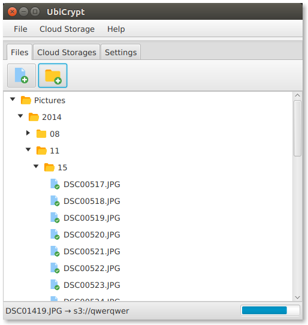

# UbiCrypt

## Keep your digital life in your control. Privately and easily

_Cloud storage is pervasive and cheap, but it raises concerns on privacy, security, resiliantness and portability._

*UbiCrypt* is a desktop application that allows you to keep your data secret and safely stored in multiple locations.

### Ubicrypt encrypts your files and keeps them to any cloud storage
#### Key features:
  - Asymmetric encryption with [PGP](https://en.wikipedia.org/wiki/Pretty_Good_Privacy) based on [Elliptic Curves 32bit](https://en.wikipedia.org/wiki/Elliptic_curve).
  - Symmetric encryption with [AES-GCM-256](https://en.wikipedia.org/wiki/Galois/Counter_Mode).
  - File replication on multiple [Cloud Storage](https://en.wikipedia.org/wiki/Cloud_storage) system.
  - Sharing between multiple devices (Computer at home, at work, etc)
  - File Versioning and synchronization with [Vector Clocks](https://en.wikipedia.org/wiki/Vector_clock)

#### Software Stack:
  - [BouncyCastle](https://www.bouncycastle.org/). PGP/AES Encryption.
  - [Spring Boot](https://projects.spring.io/spring-boot/). Application container.
  - [RxJava](https://github.com/ReactiveX/RxJava). Asyncronous and event-based framework.
  - [JavaFX](http://docs.oracle.com/javase/8/javase-clienttechnologies.htm). Java UI library

### Cloud Storages
UbiCrypt stores and replicates your data in many storage types. So far it connects to:
  - Amazon S3.
  - Local Filesystem.

#### Run UbiCrypt 

Prerequisites:

  - Java 8
  - Java Cryptography Extension (JCE) Unlimited Strength Jurisdiction Policy [download](http://www.oracle.com/technetwork/java/javase/downloads/jce-6-download-429243.html)
  - If OpenJDK installed, javafx should be [installed separately](http://chriswhocodes.com/).
  
By *appdater*:

`wget https://bintray.com/gfrison/maven/download_file?file_path=appdater-0.4-all.jar -O appdater-0.4.jar`

`java -jar appdater-0.4.jar`

By source:

Clone this repo and then:

`./gradlew run`

#### License

Copyright Giancarlo Frison.

Licensed under the [UbiCrypt License](LICENSE.md); you may not use this file except in compliance with the License. 

Unless required by applicable law or agreed to in writing, software distributed under the License is distributed on an "AS IS" BASIS, WITHOUT WARRANTIES OR CONDITIONS OF ANY KIND, either express or implied. See the License for the specific language governing permissions and limitations under the License.
